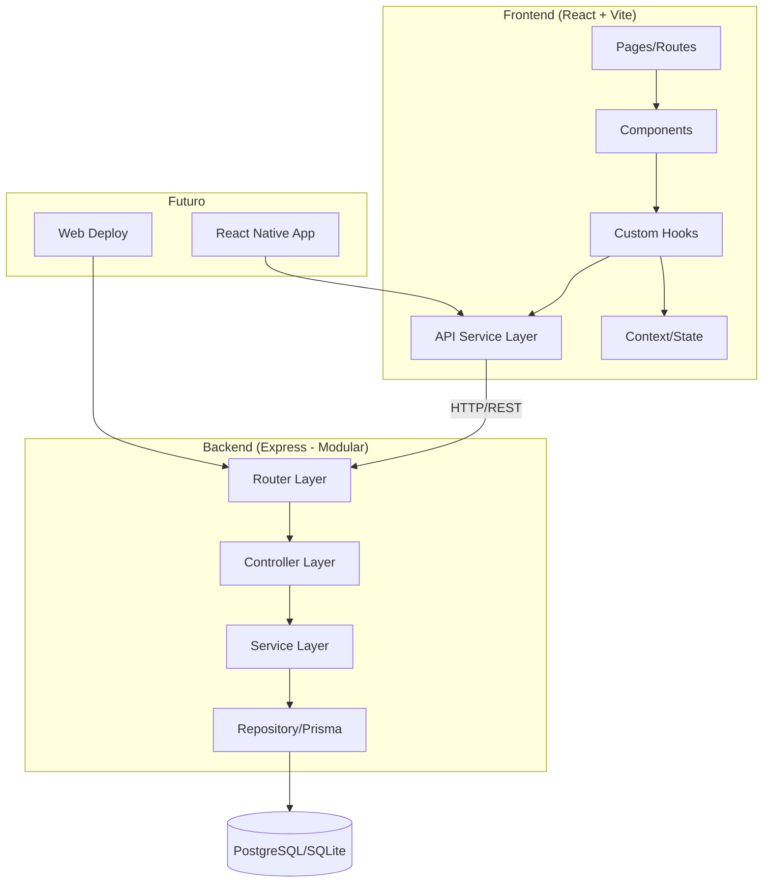
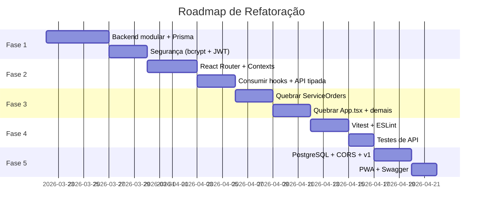

# Diagnóstico Profundo & Plano de Escalabilidade — FINANCEIRO-INOVA

## Diagnóstico Atual do Projeto

O projeto **FinanceFlow OS** é um sistema de gestão financeira e ordens de serviço para uma loja de informática. Já possui muitas funcionalidades implementadas (Dashboard, Transações, Clientes, Pagamentos, Estoque, Ordens de Serviço, Configurações, Autenticação básica). Porém, a arquitetura atual impede escalabilidade e evolução saudável.

### Números Críticos

| Arquivo | Linhas | Tamanho | Problema |
|---------|--------|---------|----------|
| [App.tsx](file:///c:/Users/reyvison/Desktop/ANTIGRAVITY/FINANCEIRO-INOVA/src/App.tsx) | 3.218 | 134 KB | God Component com 50+ useState, toda lógica de negócio centralizada |
| [ServiceOrders.tsx](file:///c:/Users/reyvison/Desktop/ANTIGRAVITY/FINANCEIRO-INOVA/src/components/ServiceOrders.tsx) | ~3.500 | 129 KB | Componente gigante com modal, formulário, lista e impressão juntos |
| [server.ts](file:///c:/Users/reyvison/Desktop/ANTIGRAVITY/FINANCEIRO-INOVA/server.ts) | 1.160 | 50 KB | Backend monolítico: DB, rotas, validação, seeds, tudo num arquivo |
| [ClientPayments.tsx](file:///c:/Users/reyvison/Desktop/ANTIGRAVITY/FINANCEIRO-INOVA/src/components/ClientPayments.tsx) | ~1.000 | 39 KB | Componente grande misturando lógica e UI |

### Problemas Identificados

#### 🔴 Críticos (Segurança & Estabilidade)
1. **Senhas em plaintext** — Armazenadas e comparadas sem hashing (`password = ?`)
2. **Sem tokens de autenticação** — Login retorna os dados do user, mas não há sessão/JWT
3. **Senha de settings visível no frontend** — `settingsPassword: '1234'` no estado React
4. **Sem rate limiting** — Rotas de login vulneráveis a brute force
5. **`z.any()` no schema de validação** — `services` e `partsUsed` não são validados
6. **SQL Injection potencial** — [getPaginatedData](file:///c:/Users/reyvison/Desktop/ANTIGRAVITY/FINANCEIRO-INOVA/server.ts#83-114) concatena strings para `tableName`, `orderBy`, `join`

#### 🟠 Arquiteturais (Bloqueadores de Escalabilidade)
7. **God Component [App.tsx](file:///c:/Users/reyvison/Desktop/ANTIGRAVITY/FINANCEIRO-INOVA/src/App.tsx)** — 50+ hooks de estado, 30+ funções fetch, toda lógica inline
8. **Sem roteamento** — Navegação via `activeScreen` string, sem URLs, sem deep links
9. **Backend monolítico** — Servidor, DB, rotas, validação, seeds tudo em 1 arquivo
10. **Prisma schema existe mas NÃO é usado** — O app usa `better-sqlite3` direto com SQL raw
11. **Hooks criados mas NÃO consumidos** — [useAppSettings](file:///c:/Users/reyvison/Desktop/ANTIGRAVITY/FINANCEIRO-INOVA/src/hooks/useAppSettings.ts#6-55), `useCustomers`, `useTransactions`, `useInventory`, `useUsers` existem mas [App.tsx](file:///c:/Users/reyvison/Desktop/ANTIGRAVITY/FINANCEIRO-INOVA/src/App.tsx) NÃO os usa
12. **Componentes duplicados** — Mesmos componentes existem na raiz de `components/` E em subpastas
13. **Estado de UI misturado com dados** — Modals, filtros, formulários, listas tudo no mesmo componente
14. **Templates de impressão em strings HTML** — XSS potencial, impossível de testar

#### 🟡 Qualidade de Código
15. **Zero testes** — Nenhum arquivo de teste encontrado no projeto inteiro
16. **Uso extensivo de `any`** — Especialmente em respostas de API e props
17. **`console.log` espalhados** — Em funções de fetch e handlers
18. **Migrações manuais** — `ALTER TABLE` em try/catch silencioso em vez de sistema de migrações real

---

## Plano de Escalabilidade em 5 Fases

> [!IMPORTANT]
> Este plano é para **análise e aprovação**. Cada fase pode ser executada em sessões separadas. O objetivo é tornar o projeto pronto para versões **mobile (React Native)** e **web (deploy em nuvem)**.

### Arquitetura Alvo



---

### Fase 1: Fundação do Backend (Prioridade Máxima)
**Objetivo**: Separar o [server.ts](file:///c:/Users/reyvison/Desktop/ANTIGRAVITY/FINANCEIRO-INOVA/server.ts) monolítico em camadas limpas e ativar segurança real.

| O que | Como | Por quê |
|-------|------|---------|
| Estrutura de pastas backend | Criar `server/routes/`, `server/controllers/`, `server/services/`, `server/middleware/` | Separação de responsabilidades |
| Ativar Prisma | Migrar de `better-sqlite3` raw para Prisma Client | Migrações automáticas, type-safety, fácil trocar para PostgreSQL |
| Hashing de senhas | Implementar bcrypt no login e criação de users | Segurança básica |
| JWT Auth | Middleware de autenticação com tokens | Sessões stateless, preparação para mobile |
| Rate limiting | `express-rate-limit` na rota de login | Proteção contra brute force |
| Error handler global | Middleware `errorHandler` centralizado | Respostas de erro padronizadas |

#### Estrutura proposta:
```
server/
├── index.ts              # Entry point, monta Express + Vite
├── database.ts           # Configuração Prisma
├── middleware/
│   ├── auth.ts           # JWT middleware
│   ├── rateLimiter.ts    # Rate limiting
│   └── errorHandler.ts   # Error handler global
├── routes/
│   ├── auth.routes.ts
│   ├── transactions.routes.ts
│   ├── customers.routes.ts
│   ├── payments.routes.ts
│   ├── serviceOrders.routes.ts
│   ├── inventory.routes.ts
│   ├── settings.routes.ts
│   └── index.ts          # Monta todas as rotas
├── controllers/          # Recebe req/res, delega para services
├── services/             # Lógica de negócio pura
└── validators/           # Schemas Zod organizados
```

---

### Fase 2: Refatoração do Frontend — Estado e Roteamento
**Objetivo**: Desmontar o God Component [App.tsx](file:///c:/Users/reyvison/Desktop/ANTIGRAVITY/FINANCEIRO-INOVA/src/App.tsx) e implementar React Router.

| O que | Como | Por quê |
|-------|------|---------|
| React Router | Instalar `react-router-dom`, criar rotas | URLs reais, deep links, preparação para web/mobile |
| React Contexts | Criar `AuthContext`, `SettingsContext`, `UIContext` | Estado global tipado e organizado |
| Consumir hooks existentes | Fazer [App.tsx](file:///c:/Users/reyvison/Desktop/ANTIGRAVITY/FINANCEIRO-INOVA/src/App.tsx) usar `useTransactions`, `useCustomers`, etc. | Evitar duplicação, já estão escritos |
| API Service tipado | Expandir [services/api.ts](file:///c:/Users/reyvison/Desktop/ANTIGRAVITY/FINANCEIRO-INOVA/src/services/api.ts) com endpoints por domínio | Centralizar chamadas, tipagem forte |
| Eliminar componentes duplicados | Manter versão de subpasta, remover raiz | Limpar confusão |

#### Meta: [App.tsx](file:///c:/Users/reyvison/Desktop/ANTIGRAVITY/FINANCEIRO-INOVA/src/App.tsx) de 3.218 → ~200 linhas (apenas layout e roteamento)

---

### Fase 3: Modularização de Componentes
**Objetivo**: Quebrar componentes gigantes em peças menores e testáveis.

| Componente Atual | Divisão Proposta |
|-----------------|-----------------|
| [ServiceOrders.tsx](file:///c:/Users/reyvison/Desktop/ANTIGRAVITY/FINANCEIRO-INOVA/src/components/ServiceOrders.tsx) (129KB) | `ServiceOrderList`, `ServiceOrderForm`, `ServiceOrderDetail`, `ServiceOrderPrint` |
| [ClientPayments.tsx](file:///c:/Users/reyvison/Desktop/ANTIGRAVITY/FINANCEIRO-INOVA/src/components/ClientPayments.tsx) (39KB) | `PaymentList`, `PaymentCard`, `PaymentSaleModal` |
| [Transactions.tsx](file:///c:/Users/reyvison/Desktop/ANTIGRAVITY/FINANCEIRO-INOVA/src/components/Transactions.tsx) (31KB) | `TransactionTable`, `TransactionFilters`, `TransactionExport` |
| [Inventory.tsx](file:///c:/Users/reyvison/Desktop/ANTIGRAVITY/FINANCEIRO-INOVA/src/components/Inventory.tsx) (16KB) | `InventoryList`, `InventoryForm` |
| Print templates | `components/print/ReceiptTemplate.tsx`, `BlankFormTemplate.tsx` |

---

### Fase 4: Qualidade e DevOps
**Objetivo**: Adicionar testes, CI/CD, e ferramentas de qualidade.

| O que | Como | Por quê |
|-------|------|---------|
| Testes unitários | Vitest para hooks e services | Cobertura mínima nos fluxos críticos |
| Testes de API | Supertest nas rotas do Express | Validar CRUD e autenticação |
| ESLint + Prettier | Configurar regras consistentes | Padrão de código automático |
| `.env` real | Criar `.env.local` com DATABASE_URL, JWT_SECRET | Variáveis de ambiente seguras |
| Docker (opcional) | Dockerfile para deploy uniforme | Preparação para deploy |

---

### Fase 5: Preparação para Multi-plataforma
**Objetivo**: Deixar a API pronta para ser consumida por apps mobile e web.

| O que | Como | Por quê |
|-------|------|---------|
| CORS configurável | Middleware Express com origens permitidas | Mobile/Web em domínios diferentes |
| API versionada | Prefixo `/api/v1/` | Evolução sem quebrar clients |
| Documentação API | Swagger/OpenAPI gerado dos schemas Zod | Mobile dev precisa de docs |
| Migrar para PostgreSQL | Trocar datasource no Prisma schema | Produção escalável (Supabase/Render) |
| Shared types package | Extrair [types.ts](file:///c:/Users/reyvison/Desktop/ANTIGRAVITY/FINANCEIRO-INOVA/src/types.ts) para package compartilhado | Mesmo tipo no frontend, backend e mobile |
| PWA básico | Service Worker + manifest.json | App mobile "de graça" via web |

---

## Ordem de Execução Recomendada



---

## Verificação

Como este plano é puramente analítico (diagnóstico + planejamento), a verificação será:

### Revisão pelo Usuário
- O usuário deve revisar este documento e confirmar:
  1. Está de acordo com a priorização das fases?
  2. Quer começar pela Fase 1 (Backend) ou prefere outra ordem?
  3. Já tem planos de deploy (Supabase/Render/Vercel)?
  4. Quer manter SQLite para desenvolvimento local e PostgreSQL para produção?
  5. Tem preferência por alguma lib de state management (Zustand vs Context)?

### Após Aprovação
- Cada fase será executada em sessões separadas
- Cada mudança será verificada com `npm run lint` e teste manual
- Builds serão validados com `npm run build` após cada fase
